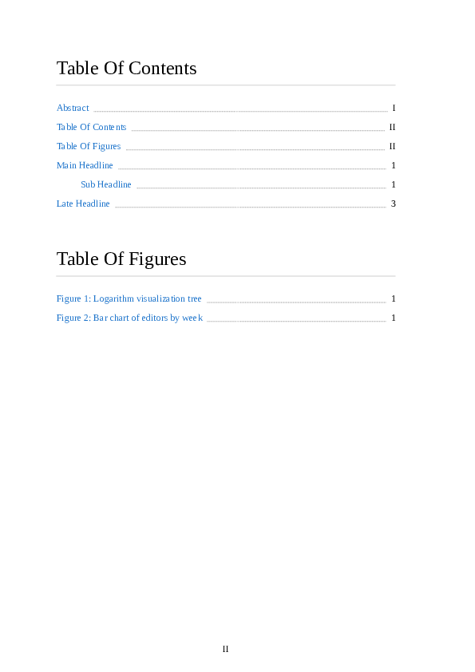
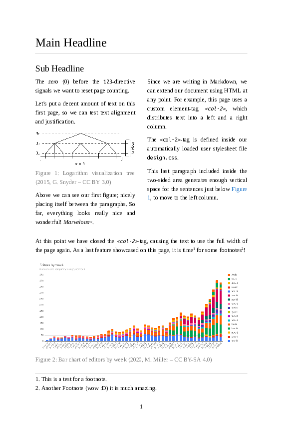

[](https://www.npmjs.com/package/paged-markdown-3) [](https://lesosoftware.com/paged-markdown-3-example.pdf)

# Paged Markdown 3

_Document format for scientific writing based on [Markdown](https://daringfireball.net/projects/markdown/)._

## About

Paged Markdown 3 is an extension of the [Markdown](https://daringfireball.net/projects/markdown/) language, that adds new syntaxes for page-breaking, page-numbering, footnotes and more. Under the hood, it is using [paged.js](https://www.npmjs.com/package/pagedjs) for content-pagination and implementing several [W3C specifications for paged media](https://www.w3.org/TR/css-page-3/).

The focus of the format is scientific writing, though it's most widely generic. Documents created in the format can be [exported to PDF](#pdf-export).

<table style="width: 80%">
<tr>
  <td>
    
  </td><td>
    
  </td>
<tr>
</table>

## Getting started

To interact with Paged Markdown 3 documents, a Markdown-capable text editor is recommended (e.g. [Atom](https://atom.io/) or [Visual Studio Code](https://code.visualstudio.com/)).

1. Create a new markdown document (e.g. `document.md`)
2. In the last line of your document, include Paged Markdown 3 as shown below:
   ```md
   # Hello world

   --

   Page 2

   <script src="https://unpkg.com/paged-markdown-3"></script>
   ```
3. Open the Markdown-preview of your editor.  
   You should see your contents rendered into pages (if not you may need to [enable Javascript](#preview-security-warnings)).  
   That's it! You've just created your first Paged Markdown 3 document.

To learn about the various syntaxes of the format, have a look at [example/scientific-paper.md](example/scientific-paper.md).

The format should work with any Markdown-capable editor of your choice. In case you experience editor-specific inconsistencies please [open an issue](https://github.com/leso-kn/paged-markdown-3/issues).

## Preview Security Warnings

When opening the Markdown-preview, you may be asked to "Enable insecure content in this document". This is due to Paged Markdown 3 being a javascript extension.

Paged Markdown 3 is open source software, you may review its source code [on Github](https://github.com/leso-kn/paged-markdown-3) or directly in the script loaded through [unpkg.com](https://unpkg.com/paged-markdown-3). If you prefer to include the script locally from your machine, you can easily [compile Paged Markdown 3](#development) yourself.

## Feature Roadmap

The following list contains features currently supported by Paged Markdown 3 or planned for future support:

* [x] Manual page-breaks
* [x] Page numbering
  * [x] Control over number styles among pages (currently `decimal`, `roman` or `none`)
* [x] Table of contents
  * [x] Auto-detect and render tables, that look like tables of contents / figures / tables etc.
  * [x] Include page number of the referenced target automatically based on its location in the document
* [x] Footnotes
* [x] Figures with captions
* [x] Tables (not yet: syntax for captions)
* [x] [PDF export](#pdf-export)
* [x] Extensible [theming](#css-theming)
* [ ] IEEE-cite linter
* [ ] Auto-generated bibliography
  * [ ] Maybe: Integration with [Zotero](https://www.zotero.org/)

## CSS Theming

As explained in the [example document](example/scientific-paper.md), the theming of Paged Markdown 3 documents can be adjusted through a user stylesheet file `design.css`, placed in the same directory as the Markdown document.

Besides user-theming and custom element definitions, `design.css` may contain global specifications about the document, such as the paper format, font-size and page margins (see [example/design.css](example/design.css) for reference).

## PDF export

Documents created in Paged Markdown 3 can be exported to PDF using the `pmd-pdf` utility [available on npm](https://www.npmjs.com/package/paged-markdown-3-pdf).

Usage:

```bash
> pmd-pdf <input.md> [output.pdf]
```

## Development

Paged Markdown 3 is developed with [buildtool.js](https://www.npmjs.com/package/buildtool.js).

To compile Paged Markdown 3 (namely `paged.js`, `logic.css` and `preview.css`), clone or download the latest version of [the repository](https://github.com/leso-kn/paged-markdown-3) and run the following commands:

```bash
> npm install
> npm run build
```

For development, you may want to make use of the watch-feature of buildtool.js (rebuild on file changes).

You can do so by running:

```bash
> npm run dev
```

The compiled files will be produced inside `dist/`.

## License

This project is licensed under the MIT-license.

---

Paged Markdown 3 – Lesosoftware, 2022
